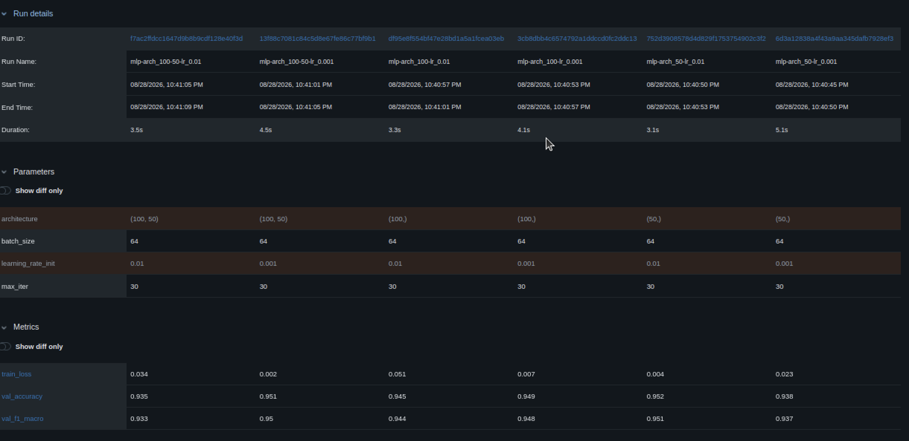

# Question 2 — Applied: MLflow Experiment Comparison

## 1. MLflow Comparison Table


## 2. Analysis
### 1. Best-Performing Run
The best-performing model is `mlp-arch_50-lr_0.01` (Run ID: `752d39...`), achieving the highest validation accuracy of **0.952** (95.2%) and a macro F1 score of **0.951**, alongside a low training loss of **0.004**. It is closely matched by `mlp-arch_100-50-lr_0.001` (Run ID: `13f88c...`) at **0.951** validation accuracy and **0.002** training loss. A single hidden layer of 50 units with an initial learning rate of 0.01 provided fast, optimal convergence without getting trapped in suboptimal local minima.

### 2. Overfitting Signals (train_loss vs. val_accuracy)
Evidence of overfitting appears in the deeper architecture `(100, 50)` when trained with `lr = 0.01`. In that run (`f7ac2f...`), `train_loss` reached **0.034**, but validation accuracy dropped to **0.935** (the lowest among all six runs). In contrast, `mlp-arch_100-lr_0.001` had a higher loss (**0.007**) yet maintained a higher validation accuracy (**0.949**), indicating that higher learning rates combined with stacked layers caused the network to memorize training batch noise rather than generalize.

### 3. Hyperparameter Impact
The **learning rate** (`learning_rate_init`) had the larger effect on overall performance and optimization dynamics. While changing architecture between 50 and 100 hidden units caused minor performance variations (within ±0.5%), switching the learning rate from 0.001 to 0.01 significantly influenced whether deeper networks generalized effectively (95.1% at 0.001 vs 93.5% at 0.01).

## 3. MLflow Logging Code Snippet
```python
# Parameter Logging
mlflow.log_param("architecture", str(config["hidden_layer_sizes"]))
mlflow.log_param("learning_rate_init", config["learning_rate_init"])
mlflow.log_param("batch_size", config["batch_size"])
mlflow.log_param("max_iter", 30)

# Metric Logging
mlflow.log_metric("train_loss", final_train_loss)
mlflow.log_metric("val_accuracy", val_acc)
mlflow.log_metric("val_f1_macro", val_f1)

